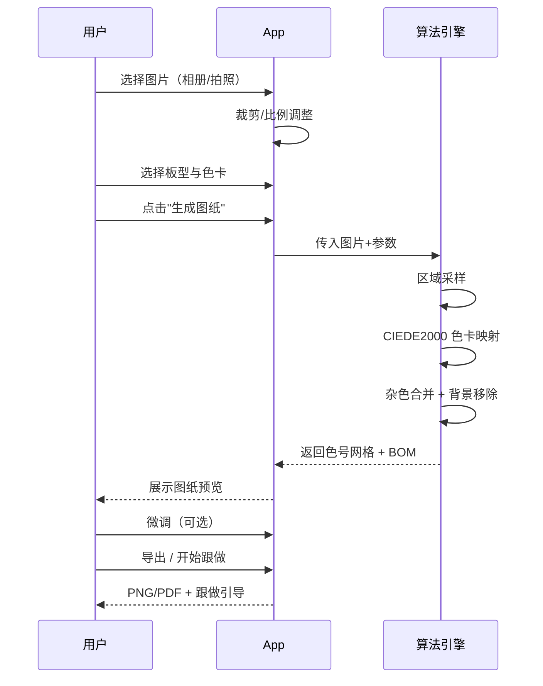

# 豆图 · 项目开发计划书

> 拼豆图纸转化器 —— 把照片变成可上手的拼豆图纸
> Flutter 双端 · 可爱系 UI · 完整开发路线

| 版本 | 日期 | 范围 |
|------|------|------|
| v1.0 | 2026-08-14 | iOS + Android 双端 |

---

## 目录

1. [项目概述](#01-项目概述)
2. [技术架构](#02-技术架构)
3. [UI 设计规范](#03-ui-设计规范可爱系)
4. [功能规格](#04-功能规格)
5. [核心算法方案](#05-核心算法方案)
6. [开发计划与里程碑](#06-开发计划与里程碑)
7. [质量保障](#07-质量保障)
8. [上架与发布](#08-上架与发布)
9. [风险登记册](#09-风险登记册)

---

## 01 项目概述

### 1.1 产品定位

豆图是一款面向中国大陆拼豆玩家与手工爱好者的移动端工具 App。用户上传任意图片，App 一键将其转化为色号准确、可直接上手的拼豆图纸，附用量清单与跟做引导。**核心价值：转换质量 + 易用性**，做"最准最好用的拼豆图纸工具"。

### 1.2 项目约束

| 维度 | 约束 | 说明 |
|------|------|------|
| 平台 | iOS + Android 双端 | Flutter 单代码库，输出 APK 与 IPA |
| 包大小 | ≤ 25MB | Release 构建 + split-per-abi + tree-shaking，预期 15–20MB |
| UI 风格 | 可爱系 | 糖果色配色、大圆角、圆润字体、贴纸/emoji 点缀 |
| 变现 | 暂不变现 | 完全免费、无广告、无内购、无限制 |
| 市场 | 仅中国大陆 | 中文界面、国内色卡优先、国内商店上架 |
| 架构 | 本地优先 | 无后端服务器、无账号体系、数据全部本地存储 |

### 1.3 目标用户

- **核心年龄段**：18-30 岁，以年轻女性为主
- **拼豆玩家**：已有拼豆基础，需要高质量图纸
- **手工爱好者**：DIY 兴趣人群，低门槛入门
- **市场背景**：2026 年国内拼豆市场规模预测约 10 亿元

### 1.4 成功标准

| 指标 | 目标 | 验证方式 |
|------|------|----------|
| 转换质量 | 10 人盲测"会直接用"是率 ≥ 80% | 上线前玩家盲测 |
| 转换速度 | 300×300 画布 ≤ 2 秒（中端手机） | 性能测试 |
| 安装量 | 上线 4 周累计 ≥ 1 万（双端） | 商店后台 + 埋点 |
| 次日留存 | ≥ 25% | 埋点统计 |
| 商店评分 | ≥ 4.6 | App Store / 应用商店 |
| 包大小 | ≤ 25MB | Release APK / IPA 实测 |

---

## 02 技术架构

### 2.1 技术栈选型

| 层 | 选型 | 版本 | 理由 |
|----|------|------|------|
| 框架 | **Flutter** | 3.22+ (stable) | 一套代码双端输出 APK + IPA；CustomPainter 天然适合网格图纸渲染；成熟生态 |
| 语言 | Dart | 3.4+ | 空安全、强类型；Isolate 支持后台计算不卡 UI |
| 状态管理 | Riverpod | 2.5+ | 轻量、类型安全、测试友好；比 Provider 更灵活，比 BLoC 更简洁 |
| 路由 | go_router | 14+ | 官方推荐，声明式路由，支持深链接 |
| 本地存储 | Hive + sqflite | — | Hive 存设置/缓存（快），sqflite 存历史作品（可查询） |
| 图像处理 | image (纯 Dart) | 4.x | 解码/缩放/像素操作，不依赖原生平台 |
| PDF 导出 | pdf + printing | — | 纯 Dart 生成 PDF，无需平台插件 |
| 文件选择 | image_picker | — | 官方插件，相册选图 + 拍照 |
| 权限 | permission_handler | — | 统一权限请求（仅相册/相机） |

### 2.2 架构分层

```
┌─────────────────────────────────────────────────┐
│  UI 层 (Screens & Widgets)                       │
│  首页/导入 · 画布设置 · 图纸预览 · 编辑器        │
│  跟做模式 · 导出/分享                            │
├─────────────────────────────────────────────────┤
│  业务逻辑层 (Riverpod Providers)                 │
│  导入 · 转换 · 编辑 · 导出 · 历史 Provider       │
├─────────────────────────────────────────────────┤
│  核心算法层 (Pure Dart，无 Flutter 依赖)         │
│  像素采样器 · 色卡映射器 · 后处理器 · 色卡数据   │
├─────────────────────────────────────────────────┤
│  数据层                                          │
│  Hive(设置/缓存) · sqflite(历史作品) · 文件系统  │
└─────────────────────────────────────────────────┘
```

**设计原则**：核心算法层是纯 Dart 代码，不依赖任何 Flutter 组件，可独立单元测试，未来也可移植到服务端或其他框架。

### 2.3 项目目录结构

```
lib/
├── main.dart                  # 入口 + App 配置
├── app.dart                   # MaterialApp + 路由 + 主题
├── core/                      # 核心算法层（纯 Dart，无 Flutter 依赖）
│   ├── sampler.dart           # 区域主色采样
│   ├── color_mapper.dart      # CIEDE2000 色卡映射
│   ├── post_processor.dart    # 杂色合并 + 背景移除
│   ├── ciede2000.dart         # 色差算法实现
│   └── palettes/              # 色卡数据
│       ├── mard_221.json
│       ├── perler.json
│       └── hama.json
├── features/                  # 功能模块（按页面划分）
│   ├── import/                # 图片导入
│   ├── canvas_setup/          # 画布与色卡设置
│   ├── preview/               # 图纸预览
│   ├── editor/                # 图纸编辑器
│   ├── craft/                 # 跟做模式
│   ├── export/                # 导出与分享
│   └── history/               # 历史记录
├── shared/                    # 共享组件与工具
│   ├── widgets/               # 通用组件
│   ├── theme/                 # 主题（配色/字体/圆角）
│   └── utils/                 # 工具函数
└── models/                    # 数据模型
    ├── pattern.dart           # 拼豆图纸模型
    ├── color_entry.dart       # 色号条目
    └── project.dart           # 作品项目
```

### 2.4 APK 大小优化策略

| 策略 | 预期节省 | 实施方式 |
|------|----------|----------|
| `--split-per-abi` | ~40% | 按 CPU 架构拆分（arm64-v8a / armeabi-v7a），用户只下载对应架构包 |
| `--tree-shake-icons` | ~1-2MB | 自动移除未使用的 Material 图标 |
| `--obfuscate + --split-debug-info` | ~10-15% | 代码混淆 + 分离调试符号 |
| ProGuard / R8（Android） | ~5-10% | 压缩和优化 Java/Kotlin 代码 |
| 精简依赖 | 变量 | 仅引入必需包，避免引入 firebase 等重型框架 |
| 图片资源优化 | ~1-3MB | 使用 WebP 格式，按需提供 1x/2x/3x |

> **预期结果**：Release APK（arm64）≈ 12-18MB，IPA ≈ 15-22MB。完全在 25MB 以内。

---

## 03 UI 设计规范（可爱系）

### 3.1 设计原则

- **圆润友好**：所有交互元素使用大圆角（16px+），按钮/卡片/输入框无尖角
- **糖果配色**：高饱和但柔和的粉色/薄荷/黄色为主，浅色背景留白充足
- **贴纸点缀**：关键位置用 emoji / 小插画点缀（如成功时的庆祝动效），但不滥用
- **三步可达**：核心流程"选图 → 设置 → 出图"不超过 3 步，高级参数折叠
- **即时反馈**：每次操作都有视觉/触觉反馈（涟漪、弹跳、轻震动）

### 3.2 配色系统

| 名称 | 色值 | 用途 |
|------|------|------|
| 暖白底 | `#FFF8F3` | 页面背景 |
| 卡片白 | `#FFFFFF` | 卡片/弹窗背景 |
| 糖果粉 | `#FF6B9D` | **主色**：主要按钮、高亮、选中态 |
| 薄荷绿 | `#6BCFB5` | **副色**：成功/确认、次级操作 |
| 亮黄 | `#FFD93D` | 点缀：选中描边、星标 |
| 天蓝 | `#6FB1FC` | 点缀：信息标签、分类 |
| 薰衣草 | `#C89BFF` | 点缀：色卡标识 |
| 蜜橙 | `#FFA45C` | 点缀：警告/提示 |
| 暖棕 | `#3D2E2A` | 正文文字 |
| 次要灰 | `#9B8B82` | 辅助/说明文字 |
| 边框 | `#F0E6DD` | 分割线、卡片边框 |

### 3.3 字体规范

| 用途 | 字体 | 字重 | 大小 |
|------|------|------|------|
| 展示标题（数字/英文） | EricaOne | 400 | 24-32px |
| 页面标题（中文） | 系统圆体 / PingFang SC | 600 | 18-22px |
| 正文 | WorkSans / PingFang SC | 400 | 15-16px |
| 辅助/说明 | WorkSans / PingFang SC | 400 | 13px |
| 色号/数据 | JetBrainsMono | 400 | 14px |

> Flutter 中通过 `GoogleFonts` 或本地 TTF 加载 EricaOne；中文字体走系统 fallback（iOS: PingFang SC, Android: Noto Sans CJK SC），无需打包中文字体文件以控制包大小。

### 3.4 组件风格

| 组件 | 样式规范 |
|------|----------|
| **主按钮** | 背景 `#FF6B9D`，白字，圆角 16px，内边距 14×24，按下缩放 0.96 + 涟漪 |
| **次按钮** | 背景 `#6BCFB5` 或描边样式（2px 糖果粉边框 + 透明底） |
| **卡片** | 白底，圆角 16px，1px `#F0E6DD` 边框，柔和阴影 `0 2px 12px rgba(255,107,157,0.05)` |
| **输入框** | 圆角 12px，浅色底 `#FFF8F3`，聚焦时糖果粉描边 2px |
| **网格画布** | 每格方形，间距 1px，色块填满，选中态高亮描边（黄色 2px） |
| **色号标签** | 圆角 999px 胶囊，色块 + 色号文本，点击可展开详情 |
| **底部导航** | 3-4 个 tab，圆润线性图标 + 文字，选中态粉色 + 轻微上浮 |
| **空状态** | 居中可爱插画 + 引导文案 + 行动按钮 |
| **加载动画** | 跳动的小拼豆（彩色圆点弹跳序列），不用 Spinner |
| **成功反馈** | 撒花/星星粒子动效 + 轻震动（HapticFeedback） |

---

## 04 功能规格

### 4.1 功能架构

```mermaid
flowchart LR
    subgraph IMP["输入"]
        I1[相册选图]
        I2[拍照]
    end
    subgraph CFG["设置"]
        C1["板型选择<br/>29/52/81/自定义"]
        C2["色卡选择<br/>MARD/Perler/Hama"]
        C3["高级参数<br/>色数上限/抖动/去背景"]
    end
    subgraph GEN["生成"]
        G1[区域采样]
        G2[CIEDE2000 映射]
        G3[杂色合并]
        G4[背景移除]
    end
    subgraph VIEW["查看与编辑"]
        V1[图纸预览]
        V2[原图对比]
        V3[成品模拟]
        V4[画笔编辑]
        V5[色号替换]
    end
    subgraph OUT["输出"]
        O1[用量清单 BOM]
        O2[PNG 导出]
        O3[PDF 导出]
        O4[跟做模式]
        O5[分享]
    end
    IMP --> CFG --> GEN --> VIEW --> OUT
```



### 4.2 核心用户流程



### 4.3 MVP 功能清单

| 优先级 | 模块 | 功能点 | 验收标准 |
|--------|------|--------|----------|
| **P0** | 图片导入 | 相册选图、拍照、裁剪与比例调整 | 支持 JPG/PNG/HEIC；裁剪后自动适配画布比例 |
| **P0** | 画布设置 | 预设板型（29×29 / 52×52 / 81×81）+ 自定义（16–256）；色卡切换 | 默认 MARD 221；切换色卡后图纸即时重算 |
| **P0** | 一键生成 | 区域采样 → CIEDE2000 映射 → 杂色合并 → 背景移除 | 52×52 ≤ 0.5s；300×300 ≤ 2s；无 <2 格孤立杂色 |
| **P0** | 图纸预览 | 网格图纸、原图对比（左右/上下滑动）、缩放平移、成品模拟 | 双指缩放 0.5x–4x；成品模拟显示真实豆子圆形渲染 |
| **P0** | 用量统计 | 各色号颗数 + 总数 + BOM 清单 | 按色号排序，显示色块/色号/名称/数量；可复制为文本 |
| **P0** | 导出分享 | 高清 PNG（图纸+色号标注）、PDF（图纸+BOM）、系统分享 | PNG ≥ 1080px；PDF A4 可打印；分享到微信/小红书/QQ |
| **P1** | 图纸编辑 | 画笔/橡皮/取色/填充、色号替换、逐格微调、撤销/重做 | 支持 10 步撤销；色号替换即时更新 BOM |
| **P1** | 跟做模式 | 按色高亮格子、行引导、完成标记、进度百分比 | 逐色引导，完成一色切下一色；可手动标记/取消 |
| **P1** | 历史记录 | 本地保存最近 20 个作品，可回看再编辑 | 缩略图列表；点击恢复完整可编辑状态 |
| **P1** | 高级参数 | 色数上限（8–64）、抖动开关、去背景开关、合并阈值 | 参数变更后预览即时更新 |
| P2 | 库存管理 | 记录各色号库存颗数，生成时提示缺口 | — |
| P2 | 3D 预览 | 3D 渲染模拟成品效果 | — |

### 4.4 页面清单

| 页面 | 路由 | 核心元素 |
|------|------|----------|
| 首页/导入 | `/` | 大按钮"选择图片" + "拍照" + 最近作品（横向滚动） |
| 裁剪页 | `/crop` | 图片裁剪框 + 比例选择（1:1 / 4:3 / 自由） |
| 设置页 | `/setup` | 板型选择卡片 + 色卡选择 + 高级参数折叠区 + "生成"按钮 |
| 预览页 | `/preview` | 图纸网格 + 原图对比切换 + BOM 浮动面板 + 底部操作栏 |
| 编辑页 | `/editor` | 图纸网格 + 工具栏（画笔/橡皮/取色/填充）+ 撤销/重做 |
| 跟做页 | `/craft` | 当前色号大卡片 + 高亮网格 + 进度条 + 下一色按钮 |
| 导出页 | `/export` | 格式选择 + 预览 + 分享按钮 |
| 历史页 | `/history` | 作品缩略图网格 + 删除/恢复 |
| 设置页（App） | `/settings` | 默认色卡、默认板型、关于、隐私政策 |

---

## 05 核心算法方案

### 5.1 算法链路

```
输入图片
    │
    ▼
① 网格化区域采样
   每格取区域主色（频率最高 RGB）
   优于单像素最近邻，避免颜色过碎
    │
    ▼
② 色卡映射
   RGB → Lab → CIEDE2000 ΔE00 → 色卡最近邻
   KD-tree 加速查询
    │
    ▼
③ 后处理
   连通域杂色合并（面积 < 阈值的块并入相邻主色）
   背景 flood fill 移除（边界感知相近色标为透明）
    │
    ▼
④ 输出
   色号网格 + BOM 用量统计 + 跟做视图
```

**关键工程决策**：跳过自由量化，直接做色卡映射。由于目标色卡固定（如 MARD 221 色），直接对每个网格主色做 CIEDE2000 最近邻匹配，比"先 k-means 量化再映射"更可控、效果更稳定。

### 5.2 各步骤详解

| 步骤 | 算法 | 输入 → 输出 | 复杂度 |
|------|------|-------------|--------|
| ① 区域采样 | 对每格对应原图区域统计 RGB 直方图，取频率最高色 | 原图 (W×H) → 网格 (N×N) 的 RGB 矩阵 | O(W×H) |
| ② 色卡映射 | RGB → Lab → CIEDE2000 ΔE00 → 色卡最近邻 | RGB 矩阵 → 色号索引矩阵 | O(N²×K)，K=色卡色数 |
| ③ 杂色合并 | BFS 四邻域遍历，面积 < 阈值的连通块并入相邻主色 | 色号矩阵 → 去杂色矩阵 | O(N²) |
| ③ 背景移除 | 边界 flood fill，感知相近的连通背景标为透明 | 去杂色矩阵 → 最终矩阵 | O(N²) |
| ④ 输出 | 色号矩阵 → 网格图 + BOM 统计 | 矩阵 → Pattern 模型 | O(N²) |

### 5.3 CIEDE2000 色差实现要点

- RGB → Lab 转换需先经 sRGB → XYZ（D65 白点）→ Lab
- ΔE00 公式包含明度、色度、色相的加权与旋转项（Sharma 2005 标准）
- 色卡预计算：启动时将色卡所有色号转 Lab 并构建 KD-tree，映射时查询 O(log K)
- 9 万格 × 221 色 ≈ 2000 万次色差 → 配合 KD-tree 约 0.1–1 秒

### 5.4 色卡数据结构

```json
// mard_221.json
[
  {
    "code": "A01",
    "name": "白色",
    "rgb": [255, 255, 255],
    "lab": [100.0, 0.0, 0.0]
  },
  {
    "code": "A02",
    "name": "乳白",
    "rgb": [248, 244, 233],
    "lab": [96.5, 1.2, 6.8]
  }
  // ... 共 221 条
]
```

启动时加载 JSON → 构建 `Map<String, LabColor>` + KD-tree 索引。色卡切换时重建索引，约 5ms。

### 5.5 性能预算

| 画布尺寸 | 格子数 | 预计耗时 | 内存 |
|----------|--------|----------|------|
| 29×29 | 841 | < 100ms | ~2MB |
| 52×52 | 2,704 | < 300ms | ~4MB |
| 81×81 | 6,561 | < 600ms | ~8MB |
| 128×128 | 16,384 | < 1s | ~15MB |
| 300×300（上限） | 90,000 | < 2s | ~40MB |

> **注意**：重计算（> 128×128）必须在 Isolate 中执行，避免阻塞 UI 线程。加载期间显示"跳动小拼豆"动画。

---

## 06 开发计划与里程碑

### 6.1 阶段总览

```mermaid
gantt
    title 开发甘特图（8 周）
    dateFormat  X
    axisFormat  W%s

    section Phase 0 · 准备
    环境搭建 + 色卡整理 + 算法原型           :p0, 0, 1

    section Phase 1 · MVP 核心
    基础架构 + 导入流程                      :p1a, 1, 1
    算法引擎 + 一键生成                      :p1b, after p1a, 1
    预览 + BOM + 导出                        :p1c, after p1b, 1

    section Phase 2 · 体验打磨
    编辑器 + 跟做 + 历史                     :p2a, 4, 1
    性能优化 + 可爱系动效                    :p2b, 4, 1

    section Phase 3 · 测试上架
    盲测 + APK优化 + 备案 + 上架             :p3a, 5, 1
    冷启动内容准备                           :p3b, 5, 1

    section Phase 4 · 验证迭代
    数据回收 + 质量调优 + 迭代               :p4a, 6, 2
```



### 6.2 分阶段任务

#### Phase 0 · 准备阶段（第 1 周）

- Flutter 开发环境搭建（Flutter 3.22+ / Xcode / Android Studio）
- 色卡数据整理：MARD 221 色号 → JSON（从品牌官方资料 + 实物校准）
- Python 算法原型：用 10 张测试图片验证 CIEDE2000 + 区域采样质量
- 竞品深度体验：拼豆图纸生成器（iOS #1）、拼豆Pic、Perlypop
- Git 仓库初始化 + 项目脚手架搭建

**交付物**：色卡 JSON 文件 × 1 + 算法质量验证报告 + 空项目仓库

#### Phase 1 · MVP 核心开发（第 2-4 周）

**第 2 周 — 基础架构 + 导入流程**
- 主题配置（可爱系配色/字体/圆角）
- 路由配置（go_router）
- 图片导入 + 裁剪页面
- 画布设置页面（板型选择 + 色卡选择）

**第 3 周 — 算法引擎 + 生成**
- Dart 移植 CIEDE2000 色差算法
- 区域采样器实现
- 色卡映射器（KD-tree 加速）
- 杂色合并 + 背景移除
- 生成按钮打通全链路

**第 4 周 — 预览 + BOM + 导出**
- CustomPainter 网格图纸渲染
- 原图对比视图（左右滑动切换）
- 成品模拟预览（圆形豆子渲染）
- 用量清单 BOM 统计与展示
- PNG / PDF 导出
- 系统分享

**交付物**：可运行的 MVP（P0 功能全通）— 内测 build v0.1

#### Phase 2 · 体验打磨（第 5 周）

- 图纸编辑器（画笔/橡皮/取色/填充/色号替换/撤销重做）
- 跟做模式（按色高亮 + 行引导 + 进度标记）
- 历史记录（本地保存 + 恢复编辑）
- 高级参数面板（色数上限/抖动/去背景/合并阈值）
- 性能优化：Isolate 后台计算 + 300×300 达标 ≤ 2s
- 可爱系动效：加载动画、成功反馈、按钮微交互

**交付物**：功能完整版 — 内测 build v0.2

#### Phase 3 · 测试与上架（第 6 周）

- 10 人玩家盲测：转换质量 + 易用性 + 虫测
- APK 大小优化（split-per-abi + obfuscate + tree-shake）
- 权限最小化审查（仅相册 + 相机）
- 隐私政策编写 + App 备案（工信部）
- App Store 提审 + 安卓商店上架（华为/小米/OPPO/vivo/应用宝）
- 冷启动内容准备：3-5 条小红书/抖音转换效果对比视频

**交付物**：上架版本 v1.0 + 冷启动内容素材

#### Phase 4 · 验证与迭代（第 7-8 周起）

- 埋点数据回收：安装量/次日留存/转换完成率/导出率
- 用户反馈收集（App 内反馈 + 社交媒体评论）
- 质量调优：根据真实图片案例优化算法参数
- 新增色卡（Artkal / COCO）
- 视数据决定 P2 功能排期

**交付物**：v1.1 迭代版本 + 数据分析报告

### 6.3 里程碑

| 里程碑 | 时间 | 标准 |
|--------|------|------|
| M1 算法验证 | 第 1 周末 | Python 原型在 10 张样本图上质量达标 |
| M2 MVP 可运行 | 第 4 周末 | P0 功能全通，可完成"选图→生成→导出"全流程 |
| M3 功能完整 | 第 5 周末 | P0+P1 全部完成，性能达标 |
| M4 上架发布 | 第 6 周末 | 双端商店审核通过，v1.0 可下载 |
| M5 数据验证 | 第 8 周末 | 4 周数据回收 + 首次迭代 |

---

## 07 质量保障

### 7.1 测试策略

| 层级 | 范围 | 工具/方式 |
|------|------|-----------|
| 单元测试 | 核心算法（采样/映射/后处理）、数据模型 | flutter_test + 固定输入→预期输出断言 |
| Widget 测试 | 关键页面交互（导入/设置/预览/编辑/跟做） | flutter_test + WidgetTester |
| 集成测试 | 端到端流程（选图→生成→导出→分享） | integration_test 包 |
| 性能测试 | 300×300 转换耗时、内存峰值、FPS | Flutter DevTools Performance + 手动计时 |
| 兼容性测试 | iOS 14+ / Android 8+，屏幕尺寸适配 | 真机测试（至少 3 台 Android + 2 台 iOS） |
| 用户盲测 | 转换质量主观评价 | 10 名拼豆玩家，10 张样本图盲评 |

### 7.2 转换质量验收标准

- 输出图纸**不含面积 < 2 格的孤立杂色块**（连通域规则）
- 人像 / 风景 / 卡通各 10 张样本，**色号数 ≤ 设定上限**且成品模拟无肉眼色差断层
- 背景移除成功率 ≥ 90%（简单背景图片）
- 10 人盲测"会直接用"是率 ≥ 80%

### 7.3 性能指标

| 指标 | 目标 | 测量方式 |
|------|------|----------|
| 52×52 转换耗时 | ≤ 300ms | 中端手机（如 Redmi Note 12） |
| 300×300 转换耗时 | ≤ 2s | 同上 |
| 冷启动时间 | ≤ 2s | 首帧渲染 |
| 峰值内存 | ≤ 80MB | 300×300 转换时 |
| 预览页 FPS | ≥ 58 | 缩放平移时 |
| APK 大小 | ≤ 25MB | arm64 release |

---

## 08 上架与发布

### 8.1 Android APK 打包流程

```bash
# 1. 生成签名密钥（仅首次）
keytool -genkey -v -keystore ~/doutu.jks \
  -keyalg RSA -keysize 2048 -validity 10000 -alias doutu

# 2. 配置 android/key.properties
storePassword=***
keyPassword=***
keyAlias=doutu
storeFile=/path/to/doutu.jks

# 3. 构建 Release APK（按架构拆分 + 混淆）
flutter build apk --split-per-abi --release \
  --obfuscate --split-debug-info=./build/symbols \
  --tree-shake-icons

# 产出：
# build/app/outputs/flutter-apk/app-armeabi-v7a-release.apk  ~15MB
# build/app/outputs/flutter-apk/app-arm64-v8a-release.apk    ~12MB
# build/app/outputs/flutter-apk/app-x86_64-release.apk       ~15MB
```

### 8.2 iOS IPA 打包流程

```bash
# 1. Apple Developer 账号 + 证书 + Profile（需 $99/年）
# 2. 构建 IPA
flutter build ipa --release \
  --obfuscate --split-debug-info=./build/symbols \
  --tree-shake-icons

# 3. Xcode Organizer 上传到 App Store Connect
# 4. TestFlight 内测 → 提审 → 上架
```

### 8.3 上架清单

| 平台 | 所需材料 | 审核周期 |
|------|----------|----------|
| App Store | Apple 账号（$99/年）、应用截图（6.7"/6.5"）、隐私政策 URL、权限说明 | 1-3 天 |
| 华为应用市场 | 开发者账号（个人免费）、APK、应用描述、隐私政策、ICP 备案 | 1-3 天 |
| 小米应用商店 | 同上 | 1-3 天 |
| OPPO 软件商店 | 同上 | 1-3 天 |
| vivo 应用商店 | 同上 | 1-3 天 |
| 应用宝（腾讯） | 同上 | 1-3 天 |
| 工信部 ICP 备案 | App 名称、包名、签名 MD5、服务器域名（如有） | **7-20 天** |

> **关键前置**：工信部 ICP 备案周期最长（7-20 天），**必须在第 1 周就启动**，否则会阻塞安卓商店上架。iOS 无此要求但需 Apple 开发者账号。

### 8.4 权限清单（最小化）

| 权限 | 用途 | Android | iOS |
|------|------|---------|-----|
| 相册读取 | 选择图片 | READ_MEDIA_IMAGES (API 33+) | NSPhotoLibraryUsageDescription |
| 相机 | 拍照导入 | CAMERA | NSCameraUsageDescription |
| 存储写入 | 导出图片/PDF | 无需（API 29+ 用 MediaStore） | NSPhotoLibraryAddUsageDescription |

**不申请的权限**：位置、通讯录、麦克风、电话、短信、蓝牙。与竞品（拼豆叭申请录音+位置等）形成差异化。

---

## 09 风险登记册

| # | 风险 | 概率 | 影响 | 对策 | 触发信号 |
|---|------|------|------|------|----------|
| R1 | 转换质量主观性：算法"准"但用户觉得"不好看" | 中 | 高 | 成品模拟预览 + 上线前 10 人盲测 + 手动编辑兜底 | 盲测是率 < 70% |
| R2 | 色卡数据不准确：实物色与屏幕色存在色差 | 中 | 高 | 采购 MARD 标准色卡样本实物拍照校准；标注色卡来源与版本 | 用户反馈"颜色对不上" |
| R3 | ICP 备案延迟导致安卓无法上架 | 中 | 高 | 第 1 周启动备案；先上 iOS（无需备案）；安卓先用蒲公英内测 | 第 4 周仍未通过 |
| R4 | Apple 开发者账号审核或提审被拒 | 低 | 中 | 提前准备隐私政策 + 权限说明；首次提审留 3 天缓冲 | 提审被拒 |
| R5 | 竞品加速涌入，窗口期缩短 | 高 | 中 | 以质量口碑为护城河；快速迭代；小红书内容占位 | 大厂产品上线 |
| R6 | 拼豆热度回落 | 中 | 中 | 算法引擎可扩展到像素画/十字绣/钻石画图纸 | 小红书话题量连续 2 月下降 |
| R7 | 300×300 性能不达标（> 2s） | 低 | 中 | Isolate + KD-tree + 预计算；必要时引入 Pixer (Rust FFI) | 性能测试超标 |
| R8 | 开源许可冲突：误用 GPL 色卡数据 | 低 | 高 | 色卡数据从官方公开资料自行整理；代码不直接复制开源项目 | 法律告知 |

---

## 附录：参考来源

1. 上一轮调研报告：拼豆图纸转化器移动端 App 完整方案（市场+竞品+技术调研）— `pindou-app-plan.html`（本目录）
2. [Flutter 官方文档：构建 Release（APK / IPA）](https://docs.flutter.dev/deployment/android)
3. [Flutter APK 大小优化指南](https://docs.flutter.dev/perf/app-size)
4. [CIEDE2000 色差公式（Sharma et al., 2005）](https://en.wikipedia.org/wiki/Color_difference#CIEDE2000)
5. [GitHub: wuZHeBoy/bead-pattern（Python CIEDE2000 + 多品牌色卡参考实现）](https://github.com/wuZHeBoy/bead-pattern)
6. [GitHub: Jett-Wu/Perler_Beads_Generator（TS 区域采样 + MARD 色卡参考）](https://github.com/Jett-Wu/Perler_Beads_Generator)
7. [image 包（Dart 纯图像处理库）](https://pub.dev/packages/image)
8. [Riverpod 状态管理文档](https://riverpod.dev/)
9. [工信部 ICP 备案指南（App 备案）](https://beian.miit.gov.cn/)
